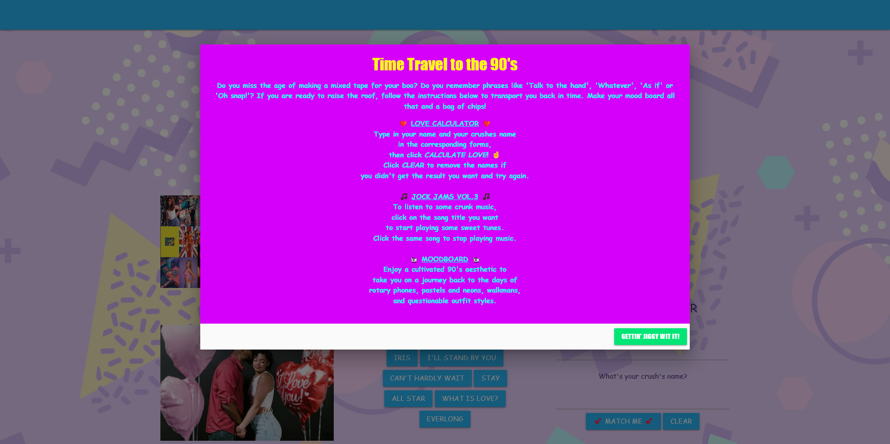
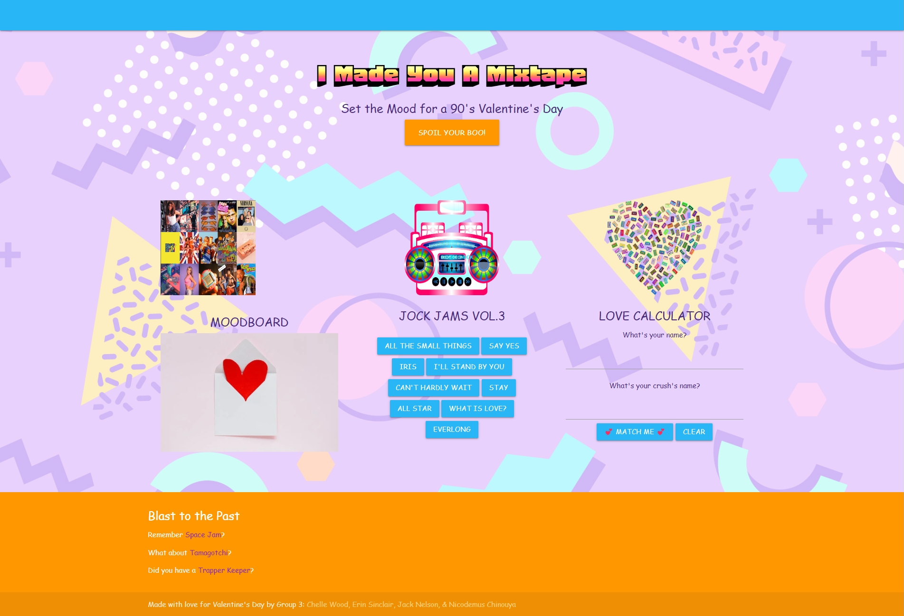

# I Made You A Mixtape

## Description

Elevator pitch-type description can go here. Ideas for future development. What we learned. What we would change. Challenges. 

## User Story

As a developer, I’m tasked with creating a unique Valentine’s Day project. The goal is to build a multisensory experience where users can discover music recommendations matching the mood of selected 90s-themed pictures, providing a nostalgic and harmonious audio-visual celebration for couples.

## Acceptance Criteria

It's done when we have two working APIs implemented into our site.
It's done when we use client-side storage to store the names and results of the Love Quiz.
It's done when we have one modal with instructions for the site.  
It's done when we employ a CSS Framework (other than Bootstrap).
It's done when our app loads with no bugs.
It's done when our app is interactive.
It's done when our page is responsive with a polished UI. 
It's done when we have a presentation ready to show the class. 
It's done when we have a deployed page with a unique url. 

## Application Image and Link

The following image shows the web application's appearance. You can also go to the web application by clicking the following link. https://jnelson4004.github.io/i-made-you-a-mixtape

 

## Authors and Acknowledgement

The following students were responsible for completing this project:
> - Chelle Wood
> - Erin Sinclaire
> - Jack Nelson
> - Nicodemus Chinouya

## Technologies Used

Pexel API

Rapid API (Love Quiz): https://rapidapi.com/ajith/api/love-calculator

CSS Framework: https://materializecss.com/

HTML Template: https://materializecss.com/templates/starter-template/preview.html

## Credits 

Modal tutorial: https://ampersandtutorials.com/materialize-css/open-modal-on-page-load/

Celeste Bradley Moore (TA): assisted Nico with coding for the song and image and marrying them and getting images to show up. Approx lines 75-105 in html

Banner Font: fonts.google.com "Honk"

Heart Tape and Boombox images: https://pixabay.com/images/

Collage image: https://www.etsy.com/listing/859999821/90s-aesthetic-wall-collage-kit-digital?etsrc=sdt

90s Background image: https://www.freepik.com/free-photos-vectors/90s-background

## License

Please refer to the MIT License in the repo.
